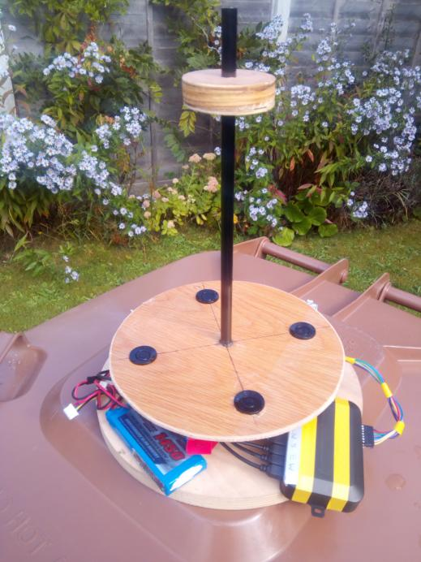
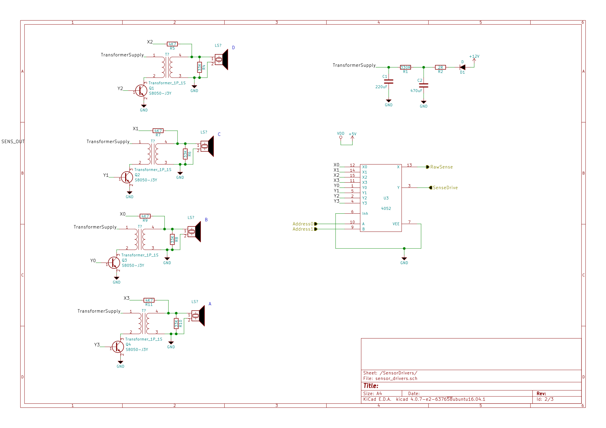
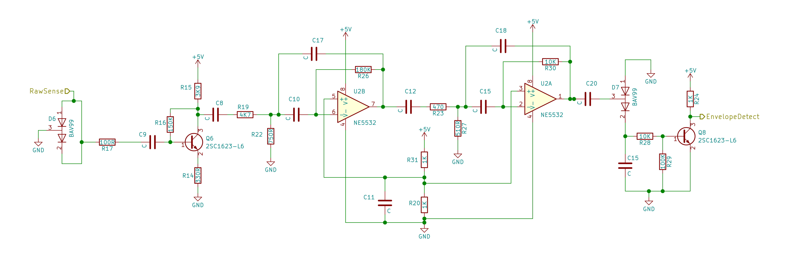
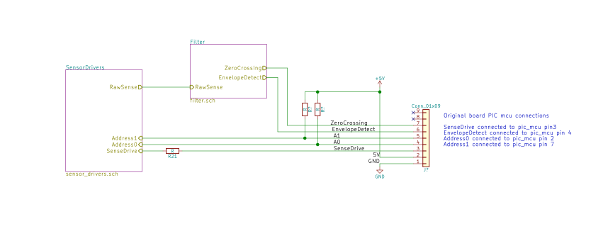
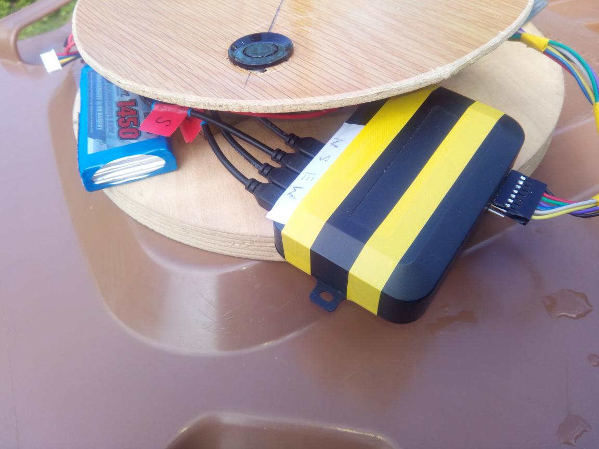
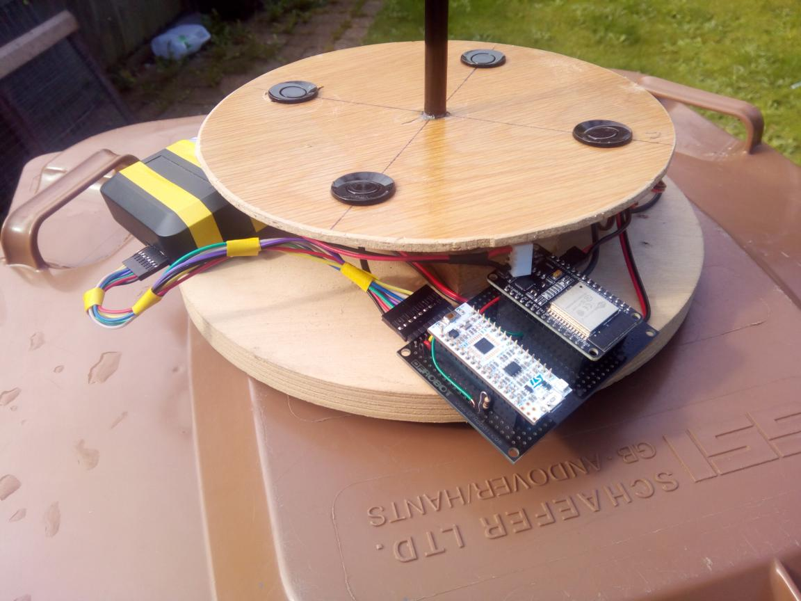

# Ultrasonic Wind speed and direction sensor from car reversing sensor kit.

A £10 car sensor reversing kit can be converted into an inexpensive but highly accurate wind speed and direction sensor.

These car reversing kits are abundant on ebay at a low price.

In the kit are :

* 4 waterproof 40 kHz ultrasonic transducers with long leads.
* A 12v power supply lead for connecting to a car battery.
* A LED display with long cable on off switch and speaker. (The display has a 14 pin mcu with same pinout as a PIC16C84, but the display is not used in this project.)
* A control box with sockets for the transducers, display and power. 
* A handy hole sawdrill which makes it easy to drill holes for the transducers.

The pcb inside the control box has:
* sockets for 
   * the 4 transducers, 
   * power 
   * 4 wire socket for serial IO ( for the display)
* A pulse transformer for each transducer.
* A multiplexer for the pulse inputs.
* A demultiplexer for the outputs.
* A bandpass filter for filtering the returned signal
* An envelope detector.

The schematic of the transducer circuit :

The schematic of the filter circuit :

There is also an 8 pin mcu on the pcb with same VCC/GND pinout as a PIC12F629.

## Hacking the control board V1

I opted not to try to reprogram the mcu on the pcb, preferring to breakout the required signals to a header hacked on to the PCB.

I had a [stm32L432 nucleo](https://www.st.com/en/evaluation-tools/nucleo-l432kc.html) which has a clock speed of 80 Mhz, 40 k of ram , as well as useful analog peripherals including 5Mbps ADC, 2 comparators and an op-amp on board.

I also had an ESP32 to send the data to a wifi network. 

These were mounted on a breadboard

### Required signals V1

Signal | Type | Description | Notes
---|---|---|---
GND| IO | Ground connection |
5V | Out | 5V from board regulator. | 5V regulator cannot provide much current!
A0 | In |transducer address selection bit 0 for IO | Pulled up to 5v for use with 3.3V mcu ( using open drain switch on pins)
A1  | In|  Transducer address selection bit 1 fro IO | Pulled up to 5v for use with 3.3V mcu ( using open drain switch on pins)
EnvelopeDetect| Out| Original envelope using Diodes and BJT | Temperature dependent?
ZeroCrossing | Out | Alternative envelope using comparator based on zero crossing and hysteresis| Provides accurate zero crossing for phase detection
SenseDrive | In | Input to drive the Transducer transformer addressed by A0 A1 | Note this is actually an analog signal fed through the 4052 analog switch. 3.3V should be ok to drive the transformer drive transistor.

I was concerned that the bjt transistor envelope detector at the output of the filter would be quite temperature dependent, which would not affect the direction sensing but may have an effect on the speed. Therefore I opted to roll my own envelope detector using a comparator and breakout out its custom output. This required fitting a little extra circuitry. 

